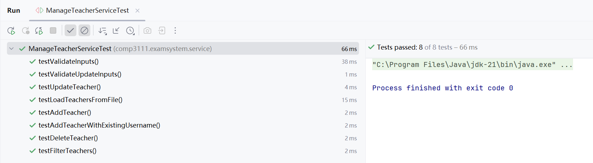

# COMP3111TeamProject
HKUST COMP3111 team project: create an Examination System for HKUST
## Project Group Information

| Group No. | 13   |
| --------- | ---- |

| Name         | GitHub User Id | UST Email        | Is Team Leader? | Owner of Team Repo? | Roles/Task in Group Project | dev branch id |
| ------------ |----------------| ---------------- | --------------- | ------------------- | --------------------------- | --------------|
| WANG Xinrui  | rrr921         | xwangjh@connect.ust.hk  | No              | No                  | Task 3                      | Task 3        |
| SHI Juanquan | JessicaStOne   | jshibh@connect.ust.hk    | No              | No                  | Task 2                      | Task 2        |
| HUANG Ziyan  | ZiyanHuang11   | zhuangfb@connect.ust.hk | Yes             | Yes                 | Task 1                      | Task 1        |

### How to Start?
You are recommended to swich to the branch Master to clone the repository for the full funtions.

### Project Information
**The detailed information of the project is concluded into a pdf file. Please see the *"Information.pdf"***
#### 1. Screenshots of the execution of the application showing sample inputs and outputs

#### 2. Report on the unit testing for the implemented tasks (100% pass)
##### *Task-1*
1.GradeStaticsServiceTest

2.QuizServiceTest

3.StudentLoginServiceTest

4.StudentMainServiceTest

5.StudentRegisterServiceTest

##### *Task-2*
1.QuestionBankManagementServiceTest

2.ExamManagementServiceTest

3.TeacherGradeStatisticServiceTest

4.TeacherLoginServiceTest

5.TeacherRegisterServiceTest

##### *Task-3*
1.ManageCourseServiceTest

2.ManagerLoginServiceTest

3.ManagerStudentServiceTest

4.ManagerTeacherServiceTest

#### Report on the coverage test (>65% branch coverage)
We have test on all the services codes,and the coverage test has 67% branch coverage.

#### Documentation on the implemented tasks using JavaDoc
We have already generate the JavaDoc and upload into the repository.

#### Supplementary Notes

We have upload three videos showing our demo of three Tasks into the repository.